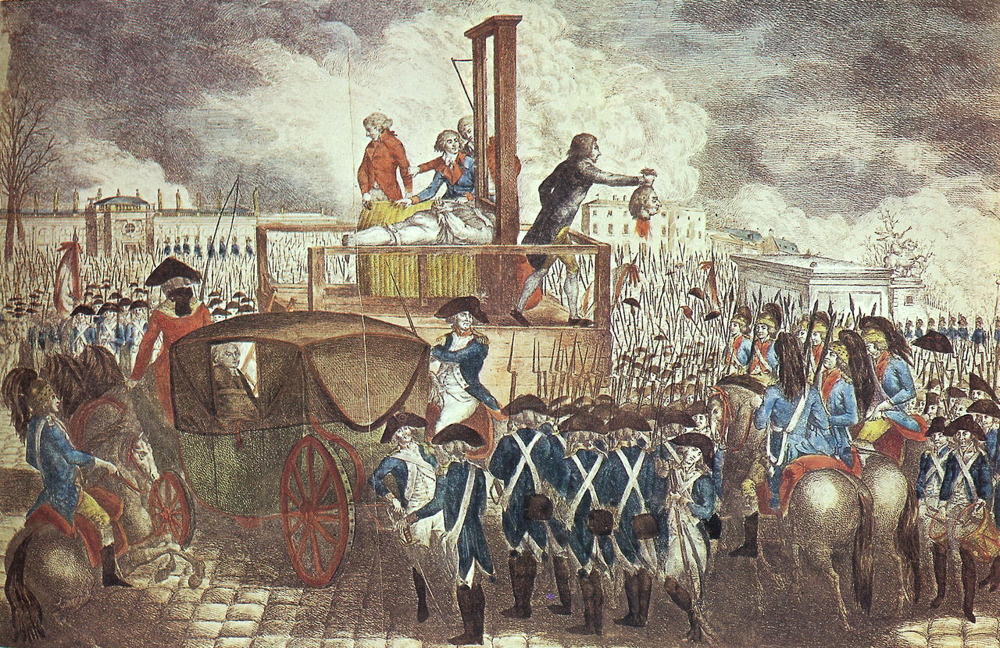
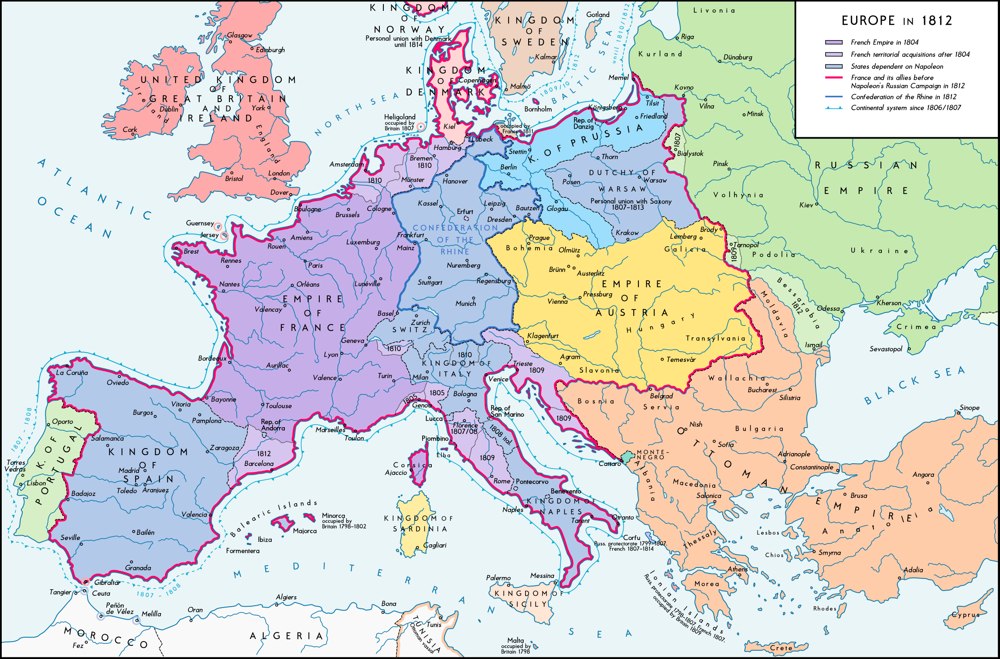

# [fit] Causes of War
# The French Revolutionary Wars
# February 5, 2015

---

# Today's Agenda

1. The causes and nature of the French Revolutionary Wars.
2. Student presentation on "Kant, Liberal Legacies, and Foreign Affairs."

---

# The Key Questions

1. Why did France's domestic revolution cause an international conflict of interest?
2. Why couldn't negotiation resolve that conflict?
3. Why did ideological conflict morph into territorial war?

---

## Why did France's domestic revolution cause an international conflict of interest?

---

# Refining the Question

Why was the protection (or restoration) of Louis XVI in Austria's interest?

i.e., how did it aid Austria's

* Security?
* Power?
* Leader retention?

---

# Potential Answers

* Fear of republican ideology spreading
* Fear of increases in French power
* Habsburg-Bourbon ties (via Marie Antoinette)
* European balance of power system

^ Frame the balance of power system in terms of a shift in what France valued

---

## Why couldn't negotiation solve the international conflict that the revolution stirred up?

---

# Medieval Rubbish

> "Still, its development [that of central state power] remained clogged by all manner of medieval rubbish, seignorial rights, local privileges, municipal and guild monopolies and provincial constitutions.  The gigantic broom of the French revolution ... swept away all these relics of bygone times."
> --Karl Marx, "The Civil War in France"[^1]

[^1]: Via Theda Skocpol, *States and Social Revolutions*, ch. 5.

---

# A New Conception of Sovereignty

* Centrality of popular consent
* National rather than legal
* Overlapping authority not recognized

---

# Nationalism and Bargaining

* Old regimes
    * Sovereignty by hereditary or treaty rights
    * Territory as medium of exchange
* Revolutionary regime
    * Popular/national sovereignty
    * What "currency" to bargain with?

^ Princelings in Alsace

^ Same story with Polish Revolution and territorial concessions

^ Cutting off limbs analogy

---

# An Alternative Explanation
## War Makes the Revolution and the Revolution Makes War

> "If the attempted flight of the king could not finally delegitimate the monarchy, then only the gravest charge that can be made against a sovereign would suffice—high treason.  For that, war was needed."
> -- T.C.W. Blanning, *The French Revolutionary Wars* (pp. 55–56)

---

## Why did ideological conflict morph into territorial war?

---

---

# Power and Revolution

The revolutionary state was a more powerful state.

* *Levée en masse*
* *Esprit de corps*
* Tactical innovations
    * Divisions
    * Light infantry
    * Artillery

---

# Power and Territory: The Traditional Explanation

When a state gains power, it should eventually gain a commensurate amount of territory.

But...

* Differences from old regime values
* If for security, why such a wide scope?
* Why through war instead of demands?

^ Note how the ideological differences had pros and cons for territorial expansion

---

# Feeding the Mass Army

Benefits of keeping the army out of the country:

* Millions less mouths to feed
* Reduced risk of further domestic instability

^ Remind that a major fiscal crisis was what kicked off the revolution to begin with

^ French pop = 28 million, post-levee army = 1.5 million

---

# Back to the Bargaining Model Once More

In the standard model, a bargaining range exists because war is costly for both sides.

All bets are off if the costs of peace exceed the costs of war.

---

# Further Reading

* T.C.W. Blanning,  *The Origins of the French Revolutionary Wars* and *The French Revolutionary Wars*
* Gunther E. Rothenberg, *The Art of Warfare in the Age of Napoleon*
* Theda Skocpol, *States and Social Revolutions*

---

# For Next Time

* Finish reading Howard
* First critical response paper due
* Student presentations on "The Security Dilemma and Ethnic Conflict" and "Nationalism and the Marketplace of Ideas"

---

# Image Sources

* Georg Heinrich Sieveking, "Hinrichtung Ludwigs des XVI": [Wikimedia Commons](http://commons.wikimedia.org/wiki/File:Hinrichtung_Ludwig_des_XVI.png)
* Alexander Altenhof, map of Europe in 1812: [Wikimedia Commons](http://commons.wikimedia.org/wiki/File:Europe_1812_map_en.png)
