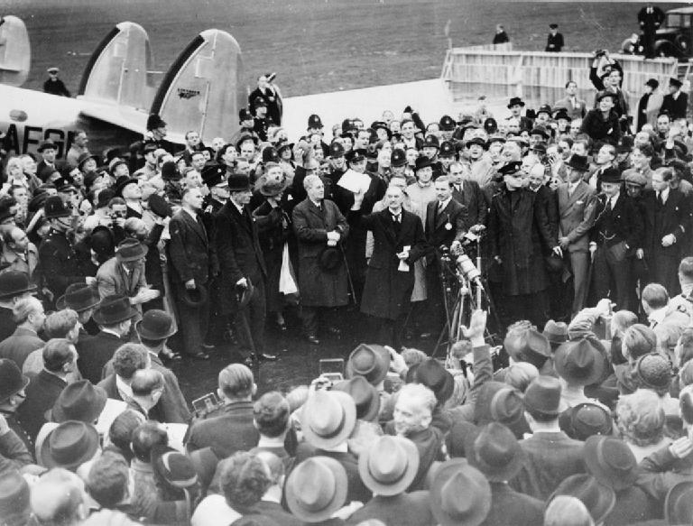

# [fit] Causes of War
# Bargaining and Commitment
# March 10, 2015

---

# Today's Agenda

1. Bargaining and commitment.
2. Presentation on "The Critical Barrier to Civil War Settlement."
3. Presentation on "Two Cheers for Bargaining Theory."

---

# A Note on Presentations

**Clarification:** If you miss your presentation date, you will receive a zero for the presentation, unless you provide documentation of a family or medical emergency.

---

# Recap: Bargaining in the Shadow of War

* War is costly
* There are settlements both sides prefer to fighting
* Why can't we find them?

^ Go over the basic elements again

^ Re-explain why uncertainty hinders settlements

---

# Anarchy

* No world government
* States can always use force against each other
* Contracts aren't enforceable

---

^ Can make contracts → don't have to worry about shakedown after paying

^ What about buying a car from the mafia?  (Efficiency?)

---

# Bargaining and Anarchy

* Settlements aren't binding contracts
* States now can't commit themselves not to use force later
* Expectations may sink negotiations

---

# Does Anarchy Cause War?

Anarchy is a *constant*.

But war is not.

^ Remind of counterfactuals (so anarchy might be a cause, but it's not the sole one)

---

# Commitment Problems as a Cause of War

1. I must rather renege than abide by the settlement
2. You must rather fight now than let me get away with it
    * Cost of reneging can't be "priced into" settlement

---

# Why Renege?

---

# Reasons to Renege

* Dissatisfied with settlement
* Change in preferences

---

---

---

# Why *Not* Renege?

---

# Reasons Not to Renege

* Preserve reputation
* Agreement designed to be self-enforcing

---

# Self-Enforcing Agreements

^ Explain story about costly lottery (and critical assumption that p is constant)

---

# Who Reneges?

* The loser?
    * Dissatisfied with bad settlement
    * e.g., German remilitarization of the Rhineland in 1936
* Or the winner?
    * Empowered by favorable settlement
    * e.g., Hitler in Czechoslovakia

^ This is why Powell looks at commitment as a class of problems

---

# Summary

* Under anarchy, commitments aren't binding
* Potential to renege can threaten negotiation success

---

# For Next Time

* Reminder: second critical response paper due a week from today
* Read Powell, "War as a Commitment Problem" if you haven't already
* Presentations on "War Is in the Error Term" and "Terrorism, Democracy, and Credible Commitments"

---

# Image Sources

* Neville Chamberlain: [Wikimedia Commons](http://commons.wikimedia.org/wiki/File:MunichAgreement.jpg)
* Used car lot: John Lloyd, via [Flickr](https://flic.kr/p/7JzpSi)
