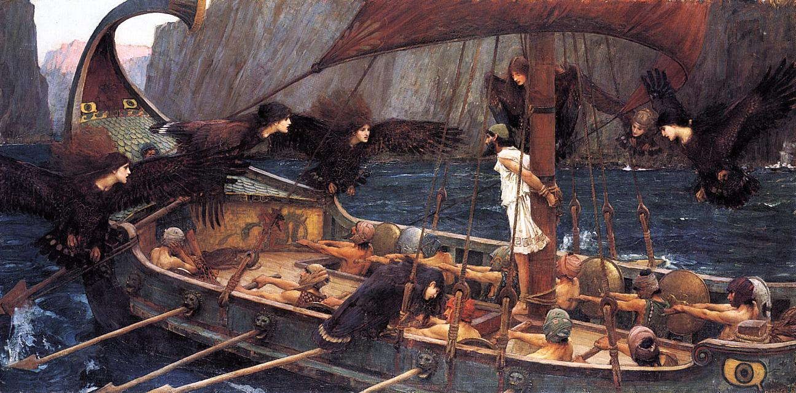

# [fit] Causes of War
# Tying Hands with Domestic Audiences
# March 26, 2015

---

# Today's Agenda

1. Domestic audience costs as a way to "tie hands" in a crisis.
2. Presentation on "Domestic Opposition and Signaling in International Crises."
3. Presentation on "Autocratic Audience Costs."

---

# Recap: Two-Level Games

* Two-level bargaining
    * Agreement among leaders
    * Ratification by public
* Democracies face more public constraints
* Effects of greater constraints
    * More favorable settlement if reached
    * Less chance of reaching settlement

---

# Two-Level Games and War
## Problems

* Why would the public's win set be narrower than the government's?
* Shouldn't we see more wars between democracies?

---

# Two-Level Games and War
## Resolving the Problems

Why would the public's win set be narrower than the governments?

* Crises take place over time
* Longer it goes, the worse it is to back down
(= "audience costs")
* ...especially for democracies

^ So the public's win set shrinks over time

^ Only once a crisis has been going on for a while does the public really become demanding

---

# Two-Level Games and War
## Resolving the Problems

Shouldn't we see more wars between democracies?

* Audience costs → Democracies tie hands quickly
* Credible signal of resolve
* Consequences
    * Democratic advantage in negotiations
    * Democratic peace

---

# Fearon's Model

At each point in a crisis, states have three choices:

1. Fight
    * Pay cost of war
    * More resolved → More willing
2. Back down
    * Pay audience cost
    * Less attractive over time
3. Wait (escalate)

---

# Locking In

* Audience costs increase over time
* At some point, worse to back down than fight
* Comes more quickly for a democracy

---

# Escalation as a Signal of Resolve

* Benefits of escalating
    * Unresolved opponent: will back down
* Costs of escalating
    * Resolved opponent: locked in
* More resolved → Willing to escalate longer

^ If your opponent is determined to fight you, better to get out before you're locked in (unless you're willing to fight too)

^ Connect to risk-reward tradeoff

---

# Signaling and Democracy

* Democracies get locked in quickly
* Unresolved democracies back down *very* quickly

^ Contrast with hypothetical case of no audience costs

---

# Crises between Democracies

If both states have high audience costs:

* Short time before war is inevitable
* Escalation signals resolve clearly and quickly
* War relatively unlikely

^ Imagine a state reaching the point when it's about to be locked in
* Audience costs soon to be worse than cost of war
* If it's reached this point, opponent almost surely even more resolved, and thus locked in
* So the state will back down now and be better off

^ Contrast with Putnam's result: here, states drop out before the domestic constraints become binding

---

# Crises between Different Regime Types

One state with high audience costs, other with low audience costs.

* Democracy signals quickly, locked in quickly
* Autocracy signals slowly, locked in slowly
* Unresolved autocracy → Backs down
* Resolved autocracy → Danger of war

^ Again imagine democracy about to be locked in
* Audience costs soon to be worse than cost of war
* Is opponent more resolved than me or not?  Don't know!  Unresolved opponent won't back down until I'm locked in anyway
* Mutual uncertainty prevails

---

# Conclusions

* Democratic advantage in crises with autocracies
* Democratic peace in crises between democracies

---

# Critiques

* Does the public care about leaders being called on a bluff?  (Should we?)
* Are audience costs worse for democracies?
* Do autocracies understand how democracies build audience costs?

---

# For Next Time

* Read chapters 1–3 of *The Sleepwalkers*

---

# Image Sources

* John William Waterhouse, "Ulysses and the Sirens": [Philolog](http://traumwerk.stanford.edu/philolog/2009/10/homers_odyssey_in_art_sirens_f.html)
